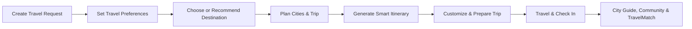
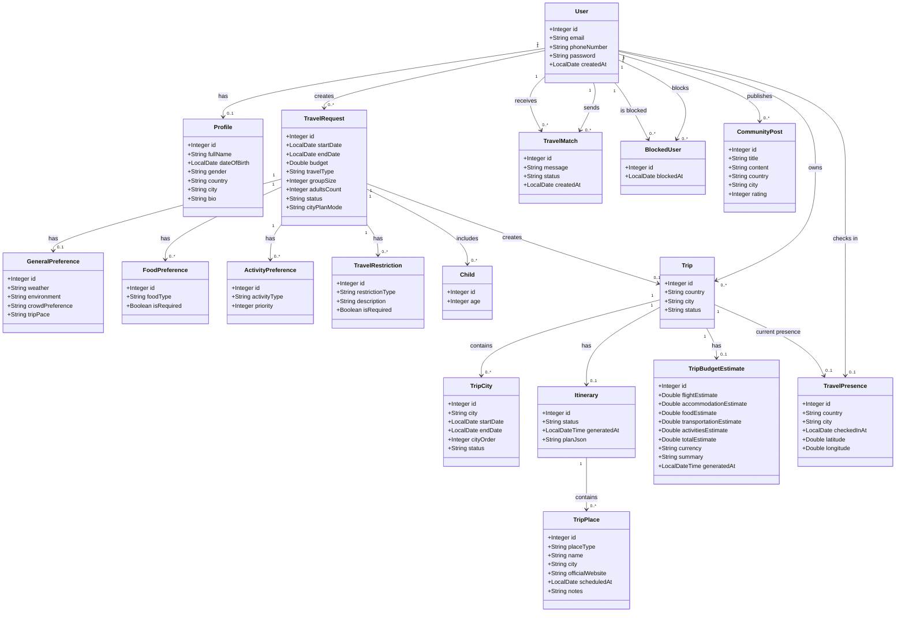
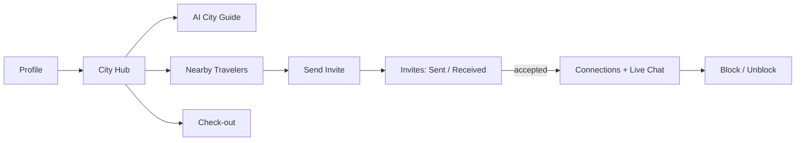
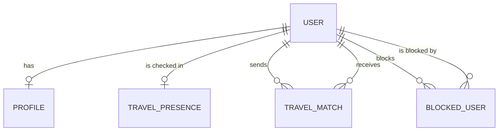

<div align="center">


# SahlDarbak | سهل دربك

### Plan Smarter, Travel Together ✈️

**SahlDarbak** is a smart travel-planning and traveler-matching web platform that helps travelers discover suitable destinations, build personalized trips, and explore their journey with greater confidence.

</div>

---

## Project Brief

**SahlDarbak** is a smart travel platform designed to support travelers before and during their trips.

The platform combines traveler preferences, trip details, artificial intelligence, and external travel data to create a more personalized travel-planning experience.

It helps travelers move from choosing a destination to planning cities and daily activities, preparing for the trip, and exploring their destination after arrival.

SahlDarbak is a **travel planning and assistance platform** and does not provide in-app booking or payment services.

---

## Problem

Planning a trip often requires travelers to use multiple platforms for different needs.

Travelers may need to search separately for destinations, weather, cities, accommodation, restaurants, activities, transportation, budgets, and travel experiences.

This can make travel planning:

- Time-consuming and fragmented.
- Difficult to personalize.
- Harder when planning multiple cities.
- Complicated when considering budget, preferences, or restrictions.
- Less convenient for travelers who want to explore or connect with others after arriving.

---

## Solution

SahlDarbak brings the main stages of the travel journey into one platform.

The system uses traveler preferences, trip information, AI, and external data to help users:

- Discover suitable destinations.
- Build personalized travel plans.
- Organize single-city or multi-city trips.
- Generate and customize daily itineraries.
- Estimate trip expenses and prepare for travel.
- Explore destination-related community experiences.
- Access a location-based city guide after arrival.
- Discover and connect with nearby travelers.
- Receive selected travel information through Email and WhatsApp.

The goal is to reduce the effort required to plan a trip while providing travelers with a more organized and personalized experience.

---

## Main Features

- AI-powered destination recommendations and comparisons.
- Personalized travel planning based on preferences, budget, and travel dates.
- Single-city and multi-city trip planning.
- Smart daily itinerary generation and trip customization.
- Trip budget estimation and travel preparation support.
- Community posts and destination-related travel experiences.
- Location-based city guide after arrival.
- Traveler matching, invitations, and chat.
- Email and WhatsApp support for selected travel information.

---

## Core User Flow



---

## Class Diagram

The following class diagram represents the **17 main entities** in SahlDarbak and their relationships.


## Flow 3: Explore (Mohammed Aljubaili)

### 1. Flow Brief

**Explore** starts once a traveler is already in a destination city. The traveler completes a short **profile**, lands on a **City Hub** that shows the city they are in, and from there can:

- read an **AI city guide** (local tips, etiquette, safety, emergency numbers),
- see how many travelers are nearby and **discover travelers in the same city**, nearest first,
- send a **TravelMatch invite** with a short message,
- accept or reject invites they receive,
- **chat in real time** with accepted connections, and get **WhatsApp notifications** for every invite action,
- **block / unblock** travelers, and **check out** when they leave the city.



| Page | Route | Purpose |
|---|---|---|
| Profile | `/profile` | Create or edit the traveler profile |
| City Hub | `/city` | Current city, nearby count, AI guide, check-out |
| Travelers | `/travel-match` | Travelers in my city (nearest first) and send invite |
| Invites | `/invites` | Sent and received invites, accept / reject |
| Connections | `/connections` | Accepted connections and live chat |
| Blocked | `/blocked` | Blocked users and unblock |

---

### 2. Models and Relationships



| Model | Key fields | Relationships |
|---|---|---|
| **Profile** | fullName, dateOfBirth, gender (`male`/`female`), country, city, bio (max 500) | One-to-one with `User` (shared primary key, `Profile.id == User.id`) |
| **TravelPresence** | country, city, latitude, longitude, checkedInAt | One-to-one with `User` (shared primary key); optional link to `Trip` |
| **TravelMatch** | message (max 300), status (`pending` / `accepted` / `rejected`), createdAt | Many-to-one `sender` and `receiver` (both `User`); unique (sender, receiver) |
| **BlockedUser** | blockedAt | Many-to-one `blocker` and `blocked` (both `User`); unique (blocker, blocked) |

All four are deleted by cascade when their `User` is deleted.

**Business rules**

- **Check-in:** country and city are never typed by the user; they are resolved from the coordinates (reverse geocoding). One presence per user, and check-out removes only the presence.
- **Invites:**
  - not to yourself, and the message is required (max 300 characters);
  - both users must be checked in to the **same country and city**;
  - no invite if either user blocked the other;
  - one invite per direction (any status), and no invite if the other user already has a pending or accepted invite to you;
  - only the **receiver** can accept or reject, and only while the invite is `pending`.
- **Blocking:** blocking ends every pending and accepted invite between the two users, and the blocked user disappears from nearby, nearest, not-invited and chat for both sides.
- **Chat:** allowed only between two users with an `accepted` invite.

---

### 3. CRUD Endpoints

| Model | Method | Endpoint | Description |
|---|---|---|---|
| Profile | GET | `/api/v1/profile/get` | All profiles |
| Profile | POST | `/api/v1/profile/add` | Create profile (one per user) |
| Profile | PUT | `/api/v1/profile/update` | Update profile |
| TravelPresence | GET | `/api/v1/travel-presence/get` | All presences |
| TravelPresence | POST | `/api/v1/travel-presence/add` | Check in (`userId`, `latitude`, `longitude`) |
| TravelPresence | PUT | `/api/v1/travel-presence/update` | Move to a new location |
| TravelPresence | DELETE | `/api/v1/travel-presence/check-out/{userId}` | Check out |
| TravelMatch | POST | `/api/v1/travel-match/add/{senderId}/{receiverId}?message=` | Send invite |
| TravelMatch | PUT | `/api/v1/travel-match/update/{inviteId}/{userId}/{status}` | Accept or reject (receiver only) |
| BlockedUser | GET | `/api/v1/blocked-user/get` | All block records |
| BlockedUser | POST | `/api/v1/blocked-user/add/{blockerId}/{blockedId}` | Block a user |
| BlockedUser | DELETE | `/api/v1/blocked-user/delete/{id}` | Delete a block record |

Intentionally missing operations:
- **Profile delete:** a profile exists as long as its user does.
- **TravelMatch get / delete:** read through the Extra endpoints; rejected rows must stay so the same invite cannot be re-sent.
- **BlockedUser update:** a block can only be added or removed.

---

### 4. Extra Endpoints

| Method | Endpoint | Description | Used in frontend |
|---|---|---|---|
| GET | `/api/v1/profile/get/{userId}` | Profile of one user | Profile page |
| GET | `/api/v1/travel-presence/nearby-count/{userId}` | Number of travelers in my city (excludes me and blocked users) | City Hub |
| GET | `/api/v1/travel-presence/nearest/{userId}` | Travelers in my city sorted by distance in km (Haversine) | Travelers |
| GET | `/api/v1/travel-match/not-invited/{userId}` | People in my city I have not invited yet | Travelers |
| GET | `/api/v1/travel-match/sent/{userId}` | Invites I sent, with the receiver's profile | Invites |
| GET | `/api/v1/travel-match/received/{userId}` | Invites I received, with the sender's profile | Invites |
| GET | `/api/v1/travel-match/pending-count/{userId}` | Number of pending invites for me | Navbar / Invites |
| GET | `/api/v1/travel-match/accepted/{userId}` | Profiles of my accepted connections | Connections |
| GET | `/api/v1/travel-match/contact/{inviteId}/{userId}` | Phone number of the other user (accepted invites only) | Not connected (the phone number is shared through WhatsApp instead) |
| GET | `/api/v1/blocked-user/get-blocked/{blockerId}` | Users I blocked, with the block id | Blocked |
| GET | `/api/v1/blocked-user/is-blocked/{userA}/{userB}` | `true` if either user blocked the other | Not connected |
| DELETE | `/api/v1/blocked-user/unblock/{blockerId}/{blockedId}` | Unblock a user | Blocked |
| GET | `/api/v1/assistant/city-guide/{userId}` | AI city guide for the city I am in (Arabic text, 4 sections) | City Hub |
| DELETE | `/api/v1/demo/reset` | Clears all invites and blocks (demo use) | Blocked |
| WebSocket | `/chat?userId={id}` | Real-time chat | Connections |

---

### 5. External APIs and Technologies

| Service | Used for | Where |
|---|---|---|
| **Nominatim (OpenStreetMap)** reverse geocoding | Turns latitude / longitude into country and city on check-in and update | `GeocodingService` |
| **Google Gemini API** (`gemini-flash-lite-latest`) | Generates the city guide: local tips, etiquette, safety, emergency numbers (Arabic, 4 sections) | `TravelerAssistantService` |
| **WhatsApp Cloud API (Meta)** | Sends a message to both users when an invite is sent, and to the sender when it is accepted (with the receiver's number) or rejected | `WhatsAppService`, called from `TravelMatchService` |
| **Spring WebSocket** | Real-time chat between accepted connections | `ChatWebSocketHandler`, `WebSocketConfig` |

**Chat details**

- Connect: `ws://host/chat?userId=1`
- Send: `toUserId:text`, for example `2:hello`
- Receive: `fromUserId: text`, or `error: ...` (not connected, user offline, wrong format)
- Technology: `TextWebSocketHandler` with in-memory sessions (`ConcurrentHashMap<userId, session>`). Messages are not stored in the database.
- The server checks for an `accepted` invite in either direction before delivering any message.

**WhatsApp:** failures never stop the request; the error is only logged, so an invite is still created if WhatsApp is down.

**Configuration (environment variables)**

```properties
gemini.api.key=${GEMINI_API_KEY}
whatsapp.phone-number-id=${WHATSAPP_PHONE_NUMBER_ID}
whatsapp.access-token=${WHATSAPP_ACCESS_TOKEN}
```

Nominatim needs no key.
---

## Team

| Team Member | Main Area |
|---|---|
| **Razan Almadan** | Discover |
| **Lama Alharbi** | Plan |
| **Mohammed Aljubaili** | Explore |

---

<div align="center">

### SahlDarbak | سهل دربك ✈️

**Plan Smarter, Travel Together**

</div>
